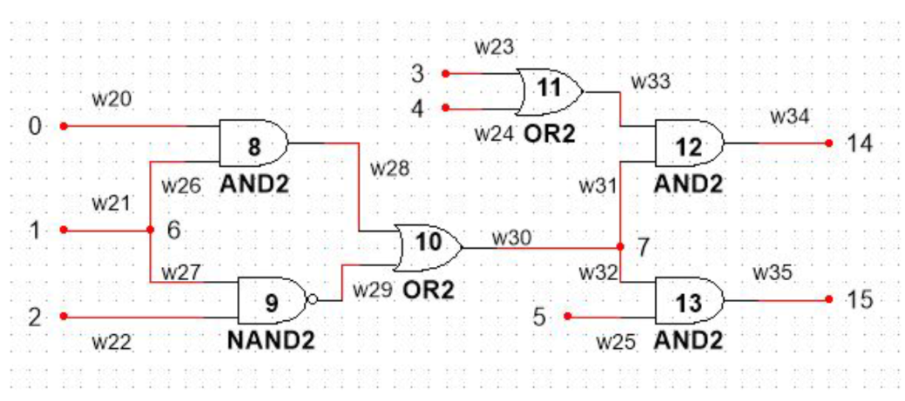
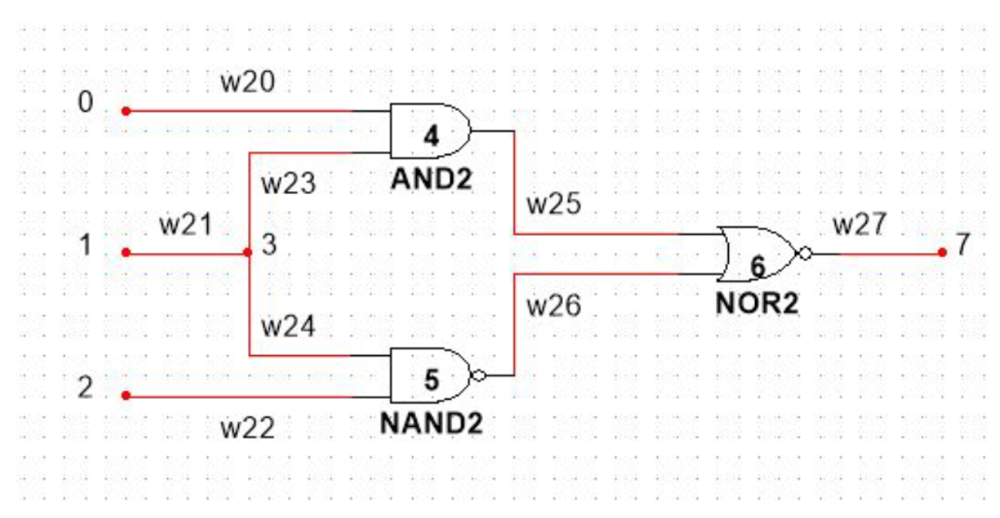
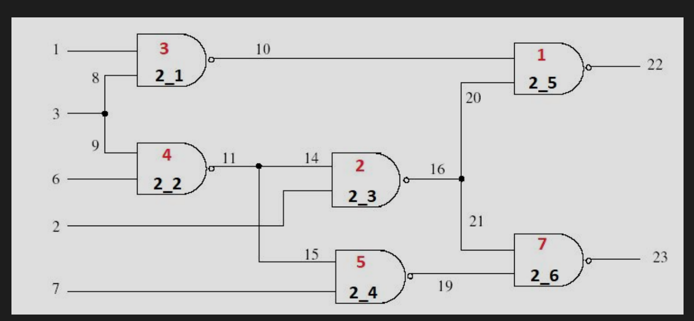
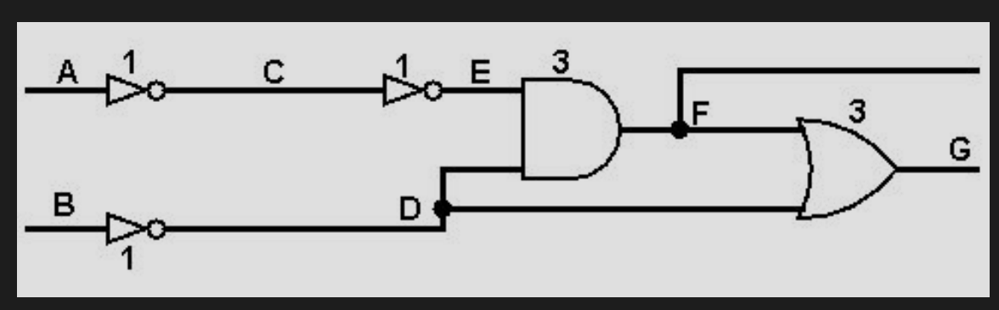

#  Implementation of Automatic Test Pattern Generator | Self Project
− Implemented PODEM algorithm for combinational test vector generation for single stuck-at-fault model. 
− Utilized path sensitization and decision-making techniques to generate effective test patterns. 
− Implemented logic simulator enabling accurate. fault simulation and verification of generated test patterns. 

This tool takes a Structural Verilog source code as an input and applies ATPG algorithms to that circuit. Algorithm results will generate input and output signal patterns that will test the resulting circuit for manufacturing defects.

# Features

- Generate ATPG for stuck-at-0 fault
- Generate ATPG for stuck-at-1 fault
- Delay timing analysis
- Critical path calculation from delays
- Path sensitization
- Critical path sensitization
- Delay fault detection
- False path detection

## Test Circuits

d_test_circ_1.v

d_test_circ_2.v

c17.v

false_path.v

